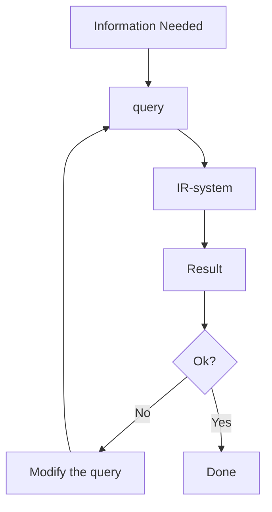

# IMT

## Why this course

It's fun :D

3 KP

Find out what happens in everyday things

## Grades

50% - 5 MD

50% - eksāmens

**Aptauja**

Late submissions - 50% reizinātājs

## Mazliet vēstures

Informācijas iegūšana (Information Retrieval jeb IR)

Oriģināli tekstu atrašana bibliotēkās, fiziskās datu bāzēs. 

1948\. g.: Pirmā datorizētā meklēšana tekstā.
1950\.-ajos gados IR kļūst par terminu

![[IMT_Jēdzieni#Information Retrieval (IR)]]

## IR pamati

- Klasiskie meklēšanas modeļi
- Saišu analīze (Link analysis), Lapu izvērtēšana (Page Rank)
- Meklēšanas rezultātu uzlabošana (Refinement of search results)
- Dokumentu indeksācija (Document indexing)
- Atgūtā izvērtēšana (Retrieval evaluation)

## Search engines

4 soļi, kas veido search engines (meklētājus)
1. Crawling
2. Ranking of results
3. How search engines "understand" text
4. Search engine optimization (SEO)

Natural Language Processing is also joining the process. 
Up until the early 2010s, search engines searched for keywords. Nowadays [[IMT_Jēdzieni#Natural Language Processing (NLP)|NLP]] is used.

## The invisible web

This course briefly overlooks the invisible web and the dark web
![[IMT_Jēdzieni#Invisible web]]
![[IMT_Jēdzieni#Dark web]]

## Semantic web, Social web, Open data

![[IMT_Jēdzieni#Open data]]

## Assignments

1. Quality of Retrieval by major search engines
2. Impact of [[IMT_Jēdzieni#Page Rank|Page Rank]]
3. [[IMT_Jēdzieni#Search Engine Optimization (SEO)|SEO]]
4. Semantic tagging of web content
5. [[IMT_Jēdzieni#Open data|Open data]]

## Information Retrieval

![[IMT_Jēdzieni#Information Retrieval (IR)]]

### Classic Information retrieval

The IR system Clusters and Catagorizes data

Retrieval models

- Set theory
- Vector algebra
- Theory of probabilities

### Then a paradigm shift occurred.

~2013 and forward

- Machine Learning
- Natural Language Processing

### Today

Representation of information.

### Bag of words

Content - text as a bag of words.

![[IMT_Jēdzieni#Bag of words]]

>[!info]- Example
>> We at DSV are the department of the IT University that focuses on bridging the gap, between on the one hand information technology, and on the other hand the social sciences, the behavioral sciences as well as the humanities.
>
>Is converted into
>
>> and, are, as (2x), at, between, behavioral, bridging, department, dsv, focuses, gap, hand (2x), humanities, information, it, of, on (3x), one, other, sciences (2x), social, technology, that, the (8x), university, we, well

Here you lose context of the content. The 2013 paradigm shift **stops** treating documents as bags of words, but interpreting the meaning of words.
Relationships between words influence the meanings of words.

### Metadata

![[IMT_Jēdzieni#Metadata]]

Examples of metadata usage:
- [Scopus](https://www.scopus.com/) as an example of a searcher by metadata
- HTML `img` tag `alt` text can be used by search engines to gain info about images although that was not its original purpose.
- Link metadata

### There are many models of IR

#### Boolean retrieval model
![[IMT_Jēdzieni#Boolean retrieval model|Boolean retrieval model]]

Introducing [[IMT_Jēdzieni#Word Proximity|word proximity]]

It can be used to improve boolean queries.

# IMT2

