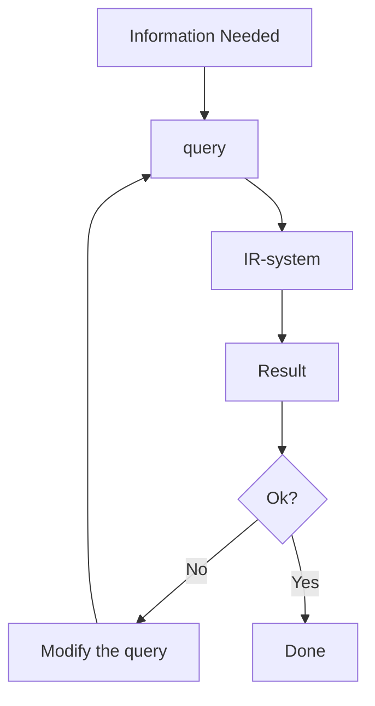
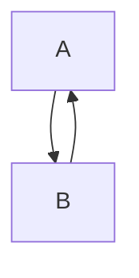
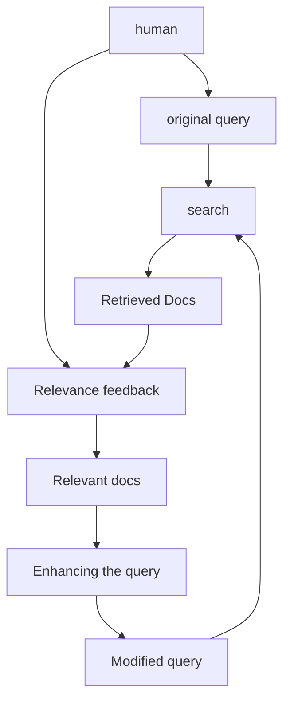

# IMT

## Why this course

It's fun :D

3 KP

Find out what happens in everyday things

## Grades

50% - 5 MD

50% - eksāmens

**Aptauja**

Late submissions - 50% reizinātājs

## Mazliet vēstures

Informācijas iegūšana (Information Retrieval jeb IR)

Oriģināli tekstu atrašana bibliotēkās, fiziskās datu bāzēs. 

1948\. g.: Pirmā datorizētā meklēšana tekstā.
1950\.-ajos gados IR kļūst par terminu

![[IMT_Jēdzieni#Information Retrieval (IR)]]

## IR pamati

- Klasiskie meklēšanas modeļi
- Saišu analīze (Link analysis), Lapu izvērtēšana (Page Rank)
- Meklēšanas rezultātu uzlabošana (Refinement of search results)
- Dokumentu indeksācija (Document indexing)
- Atgūtā izvērtēšana (Retrieval evaluation)

## Search engines

4 soļi, kas veido search engines (meklētājus)
1. Crawling
2. Ranking of results
3. How search engines "understand" text
4. Search engine optimization (SEO)

Natural Language Processing is also joining the process. 
Up until the early 2010s, search engines searched for keywords. Nowadays [[IMT_Jēdzieni#Natural Language Processing (NLP)|NLP]] is used.

## The invisible web

This course briefly overlooks the invisible web and the dark web
![[IMT_Jēdzieni#Invisible web]]
![[IMT_Jēdzieni#Dark web]]

## Semantic web, Social web, Open data

![[IMT_Jēdzieni#Open data]]

## Assignments

1. Quality of Retrieval by major search engines
2. Impact of [[IMT_Jēdzieni#Page Rank|Page Rank]]
3. [[IMT_Jēdzieni#Search Engine Optimization (SEO)|SEO]]
4. Semantic tagging of web content
5. [[IMT_Jēdzieni#Open data|Open data]]

## Information Retrieval

![[IMT_Jēdzieni#Information Retrieval (IR)]]

### Classic Information retrieval

The IR system Clusters and Catagorizes data

Retrieval models

- Set theory
- Vector algebra
- Theory of probabilities

### Then a paradigm shift occurred.

~2013 and forward

- Machine Learning
- Natural Language Processing

### Today

Representation of information.

### Bag of words

Content - text as a bag of words.

![[IMT_Jēdzieni#Bag of words]]

>[!info]- Example
>> We at DSV are the department of the IT University that focuses on bridging the gap, between on the one hand information technology, and on the other hand the social sciences, the behavioral sciences as well as the humanities.
>
>Is converted into
>
>> and, are, as (2x), at, between, behavioral, bridging, department, dsv, focuses, gap, hand (2x), humanities, information, it, of, on (3x), one, other, sciences (2x), social, technology, that, the (8x), university, we, well

Here you lose context of the content. The 2013 paradigm shift **stops** treating documents as bags of words, but interpreting the meaning of words.
Relationships between words influence the meanings of words.

### Metadata

![[IMT_Jēdzieni#Metadata]]

Examples of metadata usage:
- [Scopus](https://www.scopus.com/) as an example of a searcher by metadata
- HTML `img` tag `alt` text can be used by search engines to gain info about images although that was not its original purpose.
- Link metadata

### There are many models of IR

#### Boolean retrieval model
![[IMT_Jēdzieni#Boolean retrieval model|Boolean retrieval model]]

Introducing [[IMT_Jēdzieni#Word Proximity|word proximity]]

It can be used to improve boolean queries.

# IMT2

## Vector space model

[[IMT_Jēdzieni#Boolean retrieval model]] isn't suffucient.
Let's say we have a query $q$ and documents $d_i$
We can create a Document vector where $t_i$ is a word in the query
and each cell has a value of 1 or 0 - is the word $t_x$ inside the document $d_i$ 

|       | $t_1$ | $t_2$ | ... | $t_x$ |
| ----- | ----- | ----- | --- | ----- |
| $q$   | 1     | 1     | ... | 0     |
| $d_1$ | 0     | 1     | ... | 0     |
| $d_2$ | 1     | 1     | ... | 0     |
| ...   | ...   | ...   | ... | ...   |
| $d_y$ | 0     | 1     | ... | 1     |

One way of measuring similarity is the dot product.

$q \cdot d = \sum^{n}_{i=1}{q_i\cdot d_i}$

Longer documents will be preferred as they simply have more words that can happen to match.

Instead, we could use the angle between these vectors.

Dot product has this property that

$q \cdot d = \left|q\right| \cdot \left|d\right| \cdot \cos \alpha$

Thus we can acquire $\cos \alpha$ with the equation 

$$
\textit{sim}\left(q,d\right)
\cos \alpha = 
\frac{q\cdot d}{|q| \cdot |d|} = 
\frac{\sum_{i=1}^{n}{q_i\cdot d_i}}{\sqrt{\sum^{n}_{i=1}{q_i^2}} \cdot \sqrt{\sum^{n}_{i=1}{d_i^2}}}$$
Larger $\cos \alpha$ means closer results

Introducing: **Term weights**

Assume $\mathit{tf}_{ij}$ as the frequency of the $j$-th term in the $i$-th document.
Frequency here - the total amount of times that word appears in the document.
See [[IMT_Jēdzieni#Term frequency]]

But common words are kinda useless. Words like "the", "a" are so common, they don't really change anything. 
What about the opposite end? Let's take a look at only the rarest words.

Assume $\mathit{idf_j} = \log\left(\frac{N}{n_j}\right)$ where $n_j$ is the amount of documents that appear and $N$ is the total amount of documents

 Now we multiply these 2 metrics. the term weight is 
 
 $$
 w_{ij} =
 \mathit{tf}_{ij} \cdot \mathit{idf}_j =
 \mathit{tf}_{ij} \cdot \log\left(\frac{N}{n_j}\right)
$$
Then you can use the previous similarity formula, but use these weights

## Link analysis

*Why link analysis?*

Links usually have a reason to be there.
If something is being linked *to* a lot of times, it is probably more important.
Links are like votes. The more websites link to a specific website, the more important that website probably is. Because these votes go to others, not the website itself, they are harder to fake.

Basic idea, calculate how many incoming links and outgoing links divide this value and gives others a part of its own value.

This is the basics of **Page rank**

### Page rank

The formula:

$$
\mathit{PR}(A) = 
(1-d) + d \left(
\frac{\mathit{PR(T_1)}}{C(T_1)} + 
\frac{\mathit{PR(T_2)}}{C(T_2)} + 
... +
\frac{\mathit{PR(T_n)}}{C(T_n)}
\right)
$$
$A$ - Document we want the page rank of
$d$ - Probability that the person will click on the link. Usually $0.85$
$T_n$ - $n$-th document that links to $A$ 
$PR(X)$ - Page rank of document $X$
$C(X)$ - amount of outbound links going out of document $X$

But what about loops?
We actually don't care about them that much.

assume:

We can guess $\mathit{PR(A)}$ and $\mathit{PR}(B)$, then iterate the above formula until the values stop changing.

If the system is closed (no incoming or outgoing links out of the group), the average page rank should be exactly $1$

Page rank is Copied, not moved. Outgoing links don't ever reduce the page rank.

Usually these values are mapped onto a logarithmic 0-10 scale. Jump from 0 to 1 is easy, 9 to 10 is really difficult.

## Evaluation of retrieval

What do we evaluate?
- Does the system retrieve *all* relevant documents
- Does the system retrieve *only* relevant documents

Ideally the set of retrieved and relevant documents should be the same.

### Precision and recall

![[IMT_Jēdzieni#Precision]]

![[IMT_Jēdzieni#Recall]]

Both work against each other. The question is how to fine tune to get the best results.

![[IMT_Jēdzieni#Precision-Recall curve]]

![[Pasted image 20250207140117.png]]
### Pooling for calculating recall

#### Difficulty of recall
Humans can't figure out which of the documents are relevant. Too many documents too many for smol human brain.

Solution - **Pooling**

![[IMT_Jēdzieni#Pooling]]

### Interpolated precision-recall curve

The [[IMT_Jēdzieni#Precision-Recall curve|Precision-recall curve]] is never smooth, it's actually a discrete set of points with different search engine configurations.

An interpolated precision value is the highest measured precision value to the right of or including the current standard recall value.

We use these values to compare different search systems as each might have their own point sets.

![[Pasted image 20250207142128.png]]
Here the standard recall value is 0.1

### Average interpolated precision-recall curve

When we have multiple systems, they will have multiple recall curves. How do we construct the average?

![[Pasted image 20250207142458.png]]

| Start with interpolation | ![[Pasted image 20250207142525.png]] | ![[Pasted image 20250207142535.png]] |
| ------------------------ | ------------------------------------ | ------------------------------------ |
![[Pasted image 20250207142624.png]]
Calculate the average between the 2 interpolations.

## Improving retrieval results

### Relevance feedback

#### Explicit relevance feedback

You can explicitly show which of the results are more relevant

#### Implicit relevance feedback

- Click-through rate
- time on-site
- Bounce rate
- Conversion rate
- Returning visitors

#### Feedback for document vectors

$R_r$ - set of retrieced relevant docs
$R_n$ - set of retrieved non-relevant docs

$$
\overrightarrow{q_m} = 
\overrightarrow{q} + 
\sum_{d \in R_r}{\overrightarrow{d}} -
\sum_{d \in R_n}{\overrightarrow{d}}
$$
## Fast retrieval
### Retrieval index

You can create a multi-layered index which divides a specific concept into parts and groups these concepts together. (Very similar to database indexing)

It turns an unstructured data unit (text documents) into structured data which lets us search much faster.

>[!warning] You still need to go over the whole text to construct the index.
>That also means if you rely only on the index, you will miss documents that haven't been indexed.

We can add [[IMT_Jēdzieni#Term weights|term weights]] to the index and perfrorm a [[IMT_Jēdzieni#Vector space model|Vector space model]] search by fetching relevant entries from the index, and building a [[IMT_Jēdzieni#Document Vector|Document vector]] from them.

# IMT3

## Assignments

Iesniedz viens cilvēks, iesniegumā saraksta visus vārdus.

### Assignment 1 
>[!warning] In e-studijas it's assignment 2

Take a query, check doc similarity via [[IMT_Jēdzieni#Cosine similarity|cosine similarity]], make a [[IMT_Jēdzieni#Page Rank|page rank]], combine page rank with text similarity to query, swap around some document links, recalculate the page rank.

[Assignment 2: Impact of Page Rank](https://people.dsv.su.se/~eriks/ISBI/assignment2/)

### Assignment 2
>[!warning] In e-studijas it's assignment 1

The overall task is to build interpolated precision-recall curves for search engines.

[Assignment 1: Quality of Retrieval by Major Search Engines](https://people.dsv.su.se/~eriks/ISBI/assignment1/)

