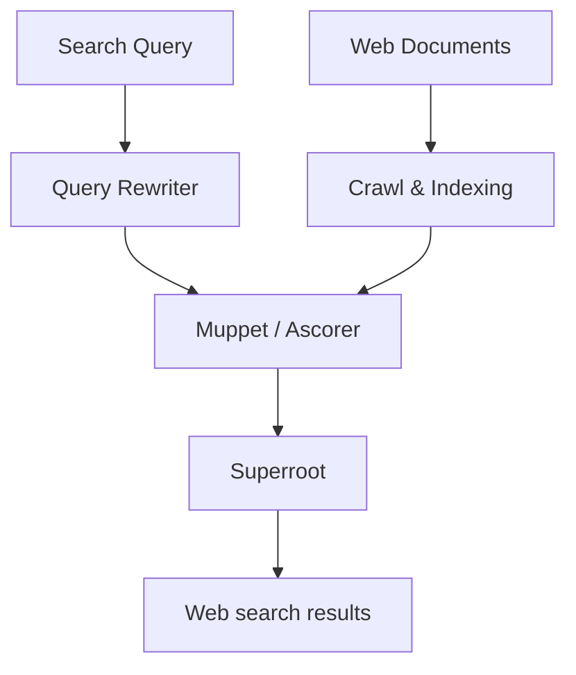

# IMT

## Google

The google search engine is HUGE.
92% of the search engine market share.

## Broken links

In general don't change well established links.
They may accumulate page rank which is good for.

One solution is redirects.

>[!info] HTTP 301 - Moved permanently
>Indicates permanent redirect [301 Moved Permanently - HTTP | MDN](https://developer.mozilla.org/en-US/docs/Web/HTTP/Status/301)


>[!info] HTTP 302 - Found
>Indicates temporary redirect [302 Found - HTTP | MDN](https://developer.mozilla.org/en-US/docs/Web/HTTP/Status/302)

Potential (not all) uses for redirects:
- local site redirect x.se -> x.com/lang-se
- moving the site to a new domain myolddomain.test -> company.co
- Shortcuts ba.com -> www.brittishairways.com
- Standardizing urls x.com -> www.x.com
- redirecting to a secure connection http://x.com -> https://x.com

## Sitemap

Every important page should be 2 clicks from the base website
Index -> Sitemap -> Page

Example of a user-friendly sitemap.
[Sitemap - CNN](https://edition.cnn.com/sitemap)

Often sitemaps are now in the form of an xml file. This standard comes from google
www.google.com/sitemap.xml


These are useful if:
- The website is complex and difficult to crawl
- Complex scripts and javascript interactions can inhibit performance
- Pages aren't linked well or linked via scripts
- The website is new, has few links.
- Videos and images have annotations

[More info from google](https://developers.google.com/search/docs/crawling-indexing/sitemaps/overview)

## Informing the search engine

There's 2 ways

- Google's Search Console Sitemaps tool
- robots.txt

## Robots exclusion protocol

Sitemaps show crawlers which pages to crawl
Robots Exclusion Protocol tells the crawler which pages to ignore.

The file is always robots.txt and is placed at the root.

Polite crawlers will obey the directives.

>[!info] Robots.txt is useful for crawlers as well
>Indicate pages which are useless to the crawler, saving on resources.
>In general increases [[IMT_Jēdzieni#Precision|Precision]] as more relevant pages will be found with less resources.

>[!warning] robots.txt is a recommendation, not an enforcement
>Any crawler may and will violate these directives

To block crawlers completely, use password protection or [[IMT_Jēdzieni#CAPTCHA|CAPTCHA]]

## Specialized links
### Nofollow

![[IMT_Jēdzieni#Nofollow-links]]


### Sponsored links
![[IMT_Jēdzieni#Sponsored links]]

### UGC (User Generated Content)
![[IMT_Jēdzieni#UGC (User Generated Content)]]


## Duplicate content

>[!info] All roads lead to rome

Duplicate content is a pain for crawlers.

This may result in crawlers penalizing annoying websites which have a lot of duplicate content.

One way to evade this is to disallow crawlers looking into duplicate pages with a lot of query params

```
User-agent: *
Disallow: /*&
```

This robots.txt will disallow polite crawlers looking into websites with more than 1 query parameter.

## How Google searches (at least kinda)

There's multiple layers:
- What Google says
- What SEO people say from experience
- US vs anti-trust lawsuit 2023 [wiki link](https://en.wikipedia.org/wiki/United_States_v._Google)
- GoogleAPI leak 2024 [leak](https://hexdocs.pm/google_api_content_warehouse/0.4.0/)

## GoogleAPI.ContentWarehouse.V1 leak

There's about 2596 class definitions, 14 014 attributes

## Ranking of documents in search results

### Basic control flow


**Query rewriter** - Interprets query and rewrites in a better form
**Crawl & Indexing** - Prepare for fast retrieval and scoring
**Muppet / Ascorer** - Retrieves and scores documents
**Superroot** - Adjusts the ranking in some way

The tricky thing is to reduce some 400 **Billion** documents to a few tens of thousands for advanced filtering

### Things we know about Google SEO

The api leak suggests that Google prioritizes the first parts of the text document.

The title should correspond with the content of the document.

Ranking is adjusted by many factors that come together to represent page quality.
Some of them:
- Popularity
- Freshness
- Accessibility
- Mobile friendly
- Friendly content
- Spell correction
- Spam
- Authority

Google pays attention to the type of clicks you interact the page with.

### Scoring layers

First use indices to find common words. reduces to a few tens of thousands of matches.

Uses topicallity, page rank, localization, other signals like phrases, keywords to reduce to a few hundred matches

Finally, a deep learning layer can be used to reduce these results to just a few hundred ranked results. See [[IMT_Jēdzieni#LLM (Large Language Model)]]

### Google's 3 pillars of ranking

- Body
	- What the document says about itself
- Anchors
	- What others say about the document
- User interactions
	- What users say about the content
	- This mainly comes in the form of [[IMT_Jēdzieni#Implicit Relevance Feedback|implicit relevance feedback]]

### NavBoost

Google wanted to know the fill clickstream data (every URL visited by a website) for a large percent of web users to improve their search engine's result quality.

A system called **NavBoost** gathered data from Google's toolbar PageRank.

![[IMT_Jēdzieni#NavBoost]]

In some cases, NavBoost was so powerful, NavBoost's signal could completely override all other signals in search refinement.

### Why does my search result differ from yours?

Some of the important context clues:
- Location
- Language
- Device type
- Related results - using the recent history of clicks to adjust rankings

According to google, 46% of all searches have local intent. 88% of mobile searches on a mobile device, the user calls or visits it within 24h


