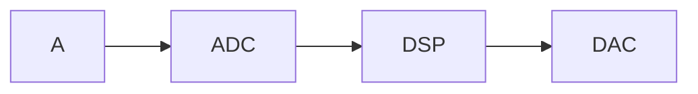

# DSP

>[!danger] Nokavēju 30 min

## Īpaša notācija

- Diskrētas funkcijas apzīmē ar $x[t]$
- Nepārtrauktas funkcijas apzīmē ar $x(t)$

## Vidējais (mean)

$$\mu =  \frac{\sum^{N}_{i=0}{x_i}}{N}$$

## Vidējā novirze (Mean absolute deviation)

$$\mathit{MAD}=\frac{\sum^{N}_{i=0}{\left|x_i-\mu\right|}}{N}$$ 
## Kvadrātiskā kļūda (variance)

$$\sigma^2 = \frac{\sum^{N}_{i=0}{\left(x_i-\mu\right)^2}}{N}$$

## Vērtību sadalījumi

![[DSP_Jēdzieni#Probability Mass Function (PMF)]]

![[DSP_Jēdzieni#Probability Density Function (PDF)]]

## Par MD

Paņem RNG, dabū 100 000

# MPM

# Tēmas

- Mācīšanās procesa likumsakarības
- Mācīšanās mērķu taksonomijas
- Mācīšanās procesa pradigmas
- Attieksmju un motivācijas loma mācīšanās procesā
- Zināšanu, prasmju un kompetenču veidošanās nosacījumi
- Mācību procesa sasniedzamo mērķu izvirzīšana un sasniegto rezultātu vērtēšanas veidi
- Mācību procesa organizatoriskie principi
- Mācību nodarbības plānošana un modelēšana
- Iekļaujoša mācību procesa principi

Beigās būs nodarbības plāns

Estudijās būs arī individuāls plāns jātaisa un jārisina problēmsituācija.

15% - Mācīšanās procesa paradigmu salīdzinājums un analīze
35% - Mācību nodarbības plānojums
50% - eksāmens (Rakstisks pārbaudes darbs)

Apmeklējums nav obligāts, bet ļoti vēlams.
## Tehnoloģijas nodarbībās

Var nākties izmantot telefonus
Neviens neiebilst :P

## Stundas plāns

Taisam pēc skola2030

[Skola2030](https://www.skola2030.lv/lv)

## Pirmās idejas atsauksme

Noslēgumā pievienot vēl vienu sasaisti ar dzīvi, un iespējams iekļaut abstraktāku mājasdarbu, sasaistīt ar dzīvi.

>[!info] Thought
>Maybe pielikt atrast mājās slīpu taisni un uzzīmēt uz rūtiņu lapas.

