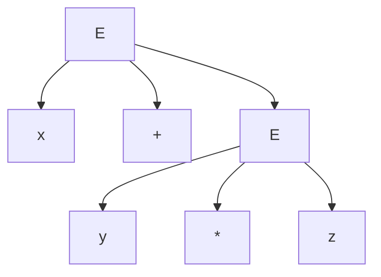
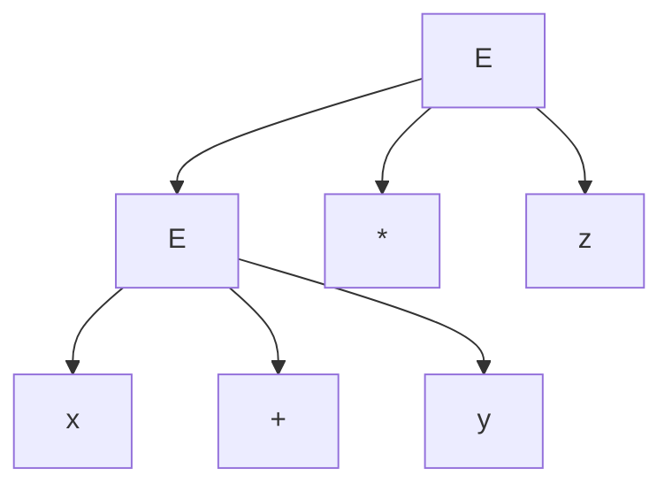

# VSS

## Reminder

![[VSS_Jēdzieni#Abstraktā sintakse]]

![[VSS_Jēdzieni#Konkrētā sintakse]]

![[2025-02-04#Sintakses piemērs]]

![[2025-02-04#Abstraktā sintakse]]

![[VSS_Jēdzieni#Bezkonteksta gramatika]]

## Bezkonteksta gramatika aritmētiskām izteiksmēm

### Pirmais mēģinājums

$E \rightarrow x|y|z|(E)|E+E|E*E$

Ir ok, bet vienādojumam veido 2 interpretācijas
$x+y*z$

Labāks, bet mazliet sarežģītāks variants

$$
\begin{align}
<E> &\rightarrow <E>+<T> &|& <E>-<T> &|& <T>\\
<T> &\rightarrow <T> * <A> &|& <T>/<A> &|& <A>\\
<A> &\rightarrow <V> &|& <C> &|& (<E>) \\
<V> &\rightarrow \text{[a-zA-Z][a-zA-Z0-9]}* \\
<C> &\rightarrow \text{[0-9]}+
\end{align}
$$
$<V>$ un $<C>$ Var izteikt arī klasiskā veidā ar papildus izvedumiem, šeit tas ir vienkāršots.

Atpazīt vienādojumu var ar galīgu automātu, jo tam formulējama regulārā izteiksme.
$<V>|<C> (op <V>|<C>)$

Taču arī šis nav pilnīgi 

## EBNF

![[VSS_Jēdzieni#EBNF (Extended Backus-Naur Form)]]

## Uzdevums

PAM gramatiku papildināt ar loģiskajām operācijām BNF un EBNF formā.

Viens piemērs: ANTLR rīks.

# AT

2-lenšu tjūringa mašīnu var nomedelēt ar 1-lentes tjūringa mašīnu.

Sākumā lentē pirmais vārds, atdalošais simbols #, tad otrs vārds.

Lai iegūtu 1. lentē papildus vietu, vajadzīgas daudzas operācijas. Ja pieņem šībrīža lielākās lentes garumu kā T, vajadzīgi 4T soļi, lai to izdarītu no sākuma pozīcijas.

~T, lai nokļūtu pirmā vārda beigās, ~T, lai katru 2. lentes vārdu pabīdītu pa labi, ~2T, lai aizietu atpakaļ..

Lai nosimulētu 2-lenšu tjūringa mašīnu ar 1-lentes tjūringa mašīnu, veicamo soļu daudzums ir kvadrātisks (principā katram solim jānoiet visa vārda garums lai atjaunotu otru lenti, kas nozīmē ka T soļi kļūst par T^2 soļiem)

## Atkāpīte par kopām

Kā sanumurēt naturālus skaitļus?
Viņi jau ir sanumurēti.

Kā sanumurēt veselus skaitļus?
0 ir pirmais, tad pamīšus, -1, 1, -2, 2, -3, 3 utt

Kā sanumurēt nat. skaitļu pārus (x,y)?
Paņem visus kur x+y=1 sakārto pēc x, tad visus kur x+y=2, tad 3, utt.

Kā sanumurēt racionālos skaitļus?
Rac. skaitļi ir izsakāmi formā x/y, sakārto x un y pārus kā iepriekšējā, un izlaid, ja rodas duplikāti (1/1 = 1, 2/2 = 1)

Visas simbolu virknes kas veidojamas no {0, 1}\*?
Vispirms virknes garumā 1, kārtotas pēc binārās vērtības,
tad visas virknes garumā 2, kārtotas pēc bin. vērtības, utt.

Visu Tjūringa mašīnu programmu kopa M?
Jā...?