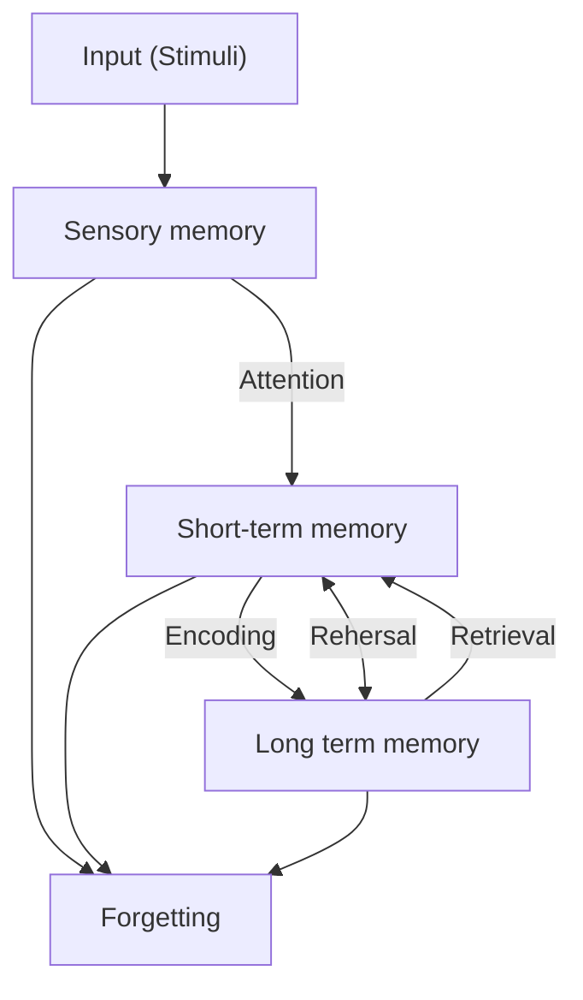
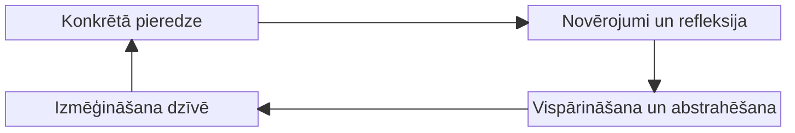

# A

## Andersona taksonomija

Arī dēvēta Blūma uzlabotā taksonomija.

Kognitīvajā jomā tiek mainīti vietām izvērtējums un sintēze, kā arī šie soļi kļūst no lietvārdiem par darbības vārdiem

![[Pasted image 20250219174432.png]]

![[Pasted image 20250219174600.png]]

Šajā taksonomija progress ir 2 dimensijās - zināšanu dimensijā un Izziņas procesu dimensijā.

Izziņās procesu dimensija redzama attēlā, zināšanu dimensijā ir Fakti, tad Konceptuālās, tad Proceduālās, tad Meta-kognitīvās zināšanas

![[Pasted image 20250219183025.png]]

No [[2025-02-19#Izglītības mērķu taksonomijas]]

## ARCS modelis

ARCS (Attention, Relevance, Confidence, Satisfaction) jeb:
- Uzmanība - uztveres, izziņas kairinātāji, stimuli, dažādība
- Atbilstība - Mērķis, Motīvu sakritība (vai tas ko māca ir tas ko vēlas), atpazīstamība
- Pārliecība - Prasību izpilde, Iespēja un izdošanās, Atbildība
- Apmierinātība - Iekšējie apbalvojumi, Ārējie apbalvojumi, ieguldījums (atgriezeniskā saite)

No [[2025-02-26#Motivācijas loma mācīšanās procesā]]

## Atkinson & Shiffrin memory model

## Atmiņa

Process, kas ietver informācijas iegaumēšanu, glabāšanu, atcerēšanos un aizmiršanu

No [[2025-02-19#Atmiņa]]
Skat [[#Atkinson & Shiffrin memory model]]

## Attieksme

> 1\. Cilvēku savstarpējais izturēšanās veids saskarsmē. Attieksme var būt pozitīva, neitrāla vai negatīva, atbalstoša vai noliedzoša, vienlīdzīga vai diskriminējoša u.tml. Attieksme nosaka gan saziņas kvalitāti, gan sadarbības produktivitāti, gan psiholoģisko klimatu kopienā, piemēram, klasē, ģimenē, kolektīvā. 2. Cilvēka uzvedības, rīcības saistība ar apkārtējo pasauli. Attieksme ir uzskats par lietām, procesiem, norisēm, to vērtējums un atbilstoša nostāja, ko veido zināšanas un kas izpaužas kā spontāna reakcija uz konkrētu notikumu vai kā vērtībās, mērķos, ideālos un normās sakņota pastāvīga, noturīga tendence. Attieksmes veidošanās ir būtiska izglītības procesa daļa. 3. dsk. Savstarpēja saistība, sakarība, mijattiecības starp objektiem, parādībām, vienumiem, lielumiem, nojēgumiem u. tml.
\- Izglītības terminu skaidrojošā tiešsaistes vārdnīca, 2023

No [[2025-03-05#Zināšanas, prasmes, attieksme, kompetence kategoriju analīze]]

## Audiālais mācīšanās stils

Mācās caur dzirdi

Skat. [[#Mācīšanās stils]]

No [[2025-02-19#Atmiņa]]

# Ā

# B

## Biheiviorisms

Teorija, ka cilvēka uzvedību iespējams **ietekmēt** un **kontrolēt** ar ārējiem stimuliem.
No šī loģiski izriet balvu/sodu sistēma.

Raksturīga pārbaudāmība, sekas, nejaušība, neuzmācīgas un neierobežojošas metodes.
Bet neuzmācīgas un neierobežojošas metodes ir diezgan maldīgs, jo bieži tas arī nav sastopams.

No [[2025-02-26#Biheiviorisms]]

## Blūma atjaunotā taksonomija

![[MPM_Jēdzieni#Blūma uzlabotā taksonomija]]

## Blūma digitālā taksonomija

Katram no [[#Blūma uzlabotā taksonomija]] minētajiem slāņiem piesaista individuālas platformas.

## Blūma taksonomija

Veidojās taksonomija 3 jomās:
- Afektīvā -> 5 līmeņi
- Psihomotorā -> 6 līmeņi
- Kognitīvā -> 6 līmeņi

**Afektīvā** joma raksturo spēju izmantot emocijas kā mācīšanās procesa rezultātu

Pamatā Uztveršana, tad reaģēšana, novērtēšana, organizēšana un konceptualizēšana, Raksturošana ar vērtību palīdzību

**Psihomotorā** raksturo spēju pielietot motorās prasmes.

Pamatā refleksās kustības, tad Pamata kustības, uztveres spējas, fiziskās spējas, kvalificētas kustības, bezvārdu komunikācija

**Kognitīvajā** jomā ietilpst cilvēka spēja jēgpilni apstrādāt informāciju

Pamatā zināšanas, tad sapratne, pielietojums, analīze, sintēze, izvērtēšana.

![[Pasted image 20250219174731.png]]

## Blūma uzlabotā taksonomija

>[!warning] Nejaukt ar [[#Blūma taksonomija]] vai [[#Blūma digitālā taksonomija]]

![[#Andersona taksonomija]]

# C

## Caurviju prasmes

Caurviju prasmes ietver nozīmīgus skolēna darbības kognitīvos, afektīvos un sociālos aspektus, kas attiecas uz visiem cilvēka darbības virzieniem. Caurviju prasmes palīdz apgūt zināšanas dažādos kontekstos un ar dažādiem domāšanas un pašvadītas mācīšanās paņēmieniem, tādējādi stiprinot jaunu zināšanu sasaisti ar personisko pieredzi. Savukārt caurviju prasmju izmantošana dažādās mācību jomās nostiprina skolēnu spējas tās izmantot patstāvīgi un visdažādākās situācijās, tostarp sarežģītās un neparedzamās.

No [[2025-03-05#Zināšanas, prasmes, attieksme, kompetence kategoriju analīze]]
### Kritiskā domāšana un problēmu risināšana 

Kritiskā domāšana un problēmrisināšana ir mērķtiecīga informācijas analīze.  

Skolēns rūpīgi un mērķtiecīgi izzina, analizē un izvērtē dažāda veida informāciju un situācijas, izprot to kontekstu; pieņem izsvērtus lēmumus, uzņemas par tiem atbildību; rīkojas, lai risinājumus problēmām izstrādātu un ieviestu; kompleksās situācijās lieto efektīvas problēmrisināšanas stratēģijas, un izvērtē savu sniegumu, pieņemot atbildīgus lēmumus, kas nozīmīgi īstermiņā un ilgtermiņā. 

Pirmsskolā šīs prasmes apgūst, vērojot, pētot dabas objektus/parādības, identificējot un nosaucot dažādas sakarības, apzinoties darbību secību, cēloņus un sekas, izvērtējot redzētā un dzirdētā ticamību, kā arī risinot ikdienas problēmsituācijas.

### Jaunrade un uzņēmējspēja 

Jaunrade ir process, kurā rodas jaunas idejas, kas ir noderīgas cilvēkam vai cilvēku grupai, bet uzņēmējspēja ļauj šīs idejas īstenot praksē, sasniedzot savus un sabiedrības mērķus. 

Skolēns meklē un saskata daudzveidīgas iespējas uzlabot dzīves kvalitāti sev un citiem. Ar drosmi un interesi izmanto iztēli, lai radītu oriģinālus, vērtīgus un noderīgus produktus un risinājumus. Uzņemas iniciatīvu un procesa vadību, lai tos mērķtiecīgi attīstītu dzīvotspējīgā piedāvājumā. 

Pirmskolā bērns, kura iniciatīvu, vēlēšanos eksperimentēt un meklēt atbildes uz paša jautājumiem atbalsta skolotājs, gūst pārliecību par savām spējām, ir gatavs apgūt ko jaunu, radīt idejas un tās īstenot. 

Rotaļājoties un eksperimentējot ar ierastām darbībām un priekšmetiem, bērns rada dažādas iepriekš nepieredzētas lietu kombinācijas, stiprina vēlmi apgūt jaunas zināšanas un prasmes, kā arī veido ieradumu izrādīt iniciatīvu un paveikt iesākto līdz galam.

### Pašvadīta mācīšanās 

Pašvadīta mācīšanās ir apzināta spriešana, reflektēšana par savām mācīšanās darbībām un spēja vadīt savu mācīšanos jebkādā dzīves situācijā, kontekstā.  

Skolēns apzinās sevi kā indivīdu, savas vēlmes, vajadzības un intereses; spēj pārvaldīt savas emocijas, domas un uzvedību, spēj izvirzīt reālus mērķus, pieņemt atbildīgus lēmumus; prot un ir motivēts pastāvīgi un patstāvīgi mācīties un pilnveidot sevi; saprot un seko līdzi savam mācīšanās procesam, izvērtē savus mācību sasniegumus, apzinās efektīvākos mācīšanās paņēmienus, plāno mācīšanās procesu un uzņemas atbildību par to. Skolēns attīsta spēju sadzīvot ar neskaidrību un neviennozīmīgām situācijām. 

Pašvadītas mācīšanās prasmes ir svarīgas, jo tās attīsta skolēnā lielāku vēlmi un motivāciju mācīties, palīdz nostiprināt zināšanas, rosina darboties mērķtiecīgi un rezultatīvi. Skolēns apzinās savas stiprās un vājās puses un to, ka kļūdas ir mācīšanās procesa neatņemama sastāvdaļa, kas ļauj saprast, ko nākamajā darīšanas reizē var veikt citādāk. 

Pirmsskolā prasmi vadīt savu mācīšanos bērni apgūst, mācoties ievērot dažādus noteikumus, atpazīstot un regulējot savas emocijas, pārvaldot savu uzvedību, piemēram, sagaidot savu kārtu vai mācoties sadzīvot ar zaudējumu spēlē. Pašvadītas mācīšanās prasmes apgūst, vēršot uzmanību uz konkrētu darbību, mācoties plānot savas darbības soļus noteiktā secībā un pabeidzot iesākto. Neatņemama pašvadītas mācīšanās prasme ir spēt sevi novērtēt, pastāstot par padarīto un par to, ko varēja darīt citādāk.

### Sadarbība 

Sadarbība ir iespēja apzināti mācīties citam no cita, samazināt darbam nepieciešamo laiku, rodot radošus risinājumus problēmām un gandarījumu par kopā paveikto.  

Skolēns dažādās dzīves situācijās un atšķirīgās sabiedrības grupās izmanto sadarbību kā efektīvu veidu kopīga mērķa sasniegšanai. Apzinās, kā paša emocijas, uzskati un vērtības ietekmē attiecības ar citiem cilvēkiem, veiksmīgi sazinās, saprotas, veido pozitīvas attiecības, mērķtiecīgi strādā neviendabīgās grupās, vienojas strīdīgos jautājumos un saskaņo rīcību, iecietīgi un ar cieņu izturas pret atšķirīgiem uzskatiem, cilvēku daudzveidību uzskata par vērtību. 

Pirmsskolā sadarbības prasmes attīstīta, sākumā veicot dažādus uzdevumus kopā ar pieaugušo. Laika gaitā tiek par ieradumu veidoti cieņpilnu attiecību veidošanā nepieciešamo iemaņu un vārdu krājuma lietošana. Pieaugot bērns mācās tikt galā ar mācību un sadzīviskām situācijām kopā ar vienaudžiem.

### Pilsoniskā līdzdalība 

Skolēns veido aktīvu dzīves pozīciju un nostiprina savu pārliecību par katra indivīda iespējām ietekmēt un izmainīt vidi un situāciju, kurā atrodas, sabiedrības un vides ilgtspēju saista ar indivīda ikdienas rīcību, saskata to gan lokālā, gan globālā mērogā, empātiski izzina daudzveidīgus uzskatus, rīkojas solidāri un atbildīgi, sarunu ceļā meklē un kopā ar citiem īsteno risinājumus pretrunīgām situācijām 

Pirmsskolā bērni mācās būt atbildīgi par sevi, līdzcilvēkiem un apkārtni. Nākotnē viņi veidos kopienu, kurā iespējams justies droši un līdzvērtīgi ar citiem, ietekmēt notiekošo, viņi nepaies garām situācijām, kas šķiet nepieņemamas. Pirmsskolas ikdienā pilsoniskās līdzdalības prasmes sāk apgūt, veidojot un ievērojot noteikumus grupā, mācoties saprast citus, līdzpārdzīvojot notiekošajam un rīkojoties videi draudzīgi. Tādējādi bērni sāk apzināti uzņemties atbildību un rīkoties.

### Digitālās prasmes 

Digitālās prasmes ir prasmes, kuras palīdz efektīvi, gudri un atbildīgi lietot digitālās tehnoloģijas. 

Skolēns atbildīgi izmanto digitālās tehnoloģijas ikdienā, lai zināšanas iegūtu, izmantotu un radītu, kā arī risinātu uzdevumus un problēmas, koplietotu un izmantotu savu un citu radītu saturu, prasmīgi pārvalda savu digitālo identitāti, efektīvi un droši komunicē un sadarbojas ar citiem digitālajā vidē; kritiski un konstruktīvi izvērtē tehnoloģiju un mediju lomu sabiedrībā. 

Pirmsskolā ir būtiski mācīties izšķirt virtuālo pasauli no reālās, saprast digitālo tehnoloģiju lomu, mācīties ievērot digitālo ierīču lietošanas nosacījumus. 

Digitālās ierīces un tehnoloģijas ir kļuvušas par mūsdienu cilvēku neatņemamu mācību, darba un izklaides daļu. Lielākā daļa bērnu zina, kas ir telefons, fotokamera, televizors, dators – šīs ierīces ģimenē lieto ikdienā. Pirmsskolā ir būtiski dažādās tehnoloģijas izmantot jēgpilni, papildinot mācīšanas un mācīšanās iespējas.

## Cone of learning (Edgar Dale)

![[Pasted image 20250219171137.png]]

Pēc 2 ned. mēs atceramies 10% lasītā, 20% dzirdētā, 30% redzētā, 50% no dzirdētā un redzētā, 70% no tā ko sakām, 90% no tā ko sakām un darām

# Č

# D

## Darba atmiņa

![[#Īstermiņa atmiņa]]

## Deklaratīvā atmiņa

Raksturo atmiņu, kurā ir pieredze, atmiņas, fakti, zināšanas.

No [[2025-02-19#Atmiņa]]
# E

## Eksperimentālā mācīšanās

Teorija pa virsu [[#Konstruktīvisms|konstruktīvismam]], kas fokusējas uz pētīšanu un personālo interesi.

# Ē

# F

# G

## Ganjē taksonomija

Taksonomija dalās 2 dimensijās:

- 5 mācīšanās kategorijās
- 9 mācību notikumi

Mācīšanās kategorijas:
1. Intelektuālās prasmes
2. Kognitīvās stratēģijas
3. Mutiska informācija
4. Motoriskās prasmes
5. Attieksme

Mācību notikumi:
1. Uzmanības pievēršana
2. Sasniedzamais rezultāts
3. Iepriekšējas zināšanas
4. Jaunā materiāla prezentācija
5. Virzīt un atbalstīt mācīšanos - tehniski var notikt visā procesā
6. Lietot jauno informāciju
7. Atgriezeniskā saite
8. Novērtēšana - var kādā veidā novērtēt paši sevi vai piemēram skolotājs skolēnus
9. Pārneses sekmēšana - spēj pārnest info uz citu tēmu

No [[2025-02-19#Izglītības mērķu taksonomijas]]
## Globālais mācīšanās stils
Mācīšanās stils, kas fokusējas uz pilno bildi caur abstrakcijām.

Skat. [[#Mācīšanās stils]]

# Ģ

# H

# I

## Ilgtermiņa atmiņa

Info glabā ilgstoši 

No [[2025-02-19#Atmiņa]]

## Izvairīšanās motivācija

Izvairīšanās motivācijas mērķis ir uzvedības virzīšana prom no negatīviem stimuliem (objektiem, notikumiem, iespējām).

Dalās 2 daļās - pieejas motivācija, izvairīšanās motivācija.
Pieejas motivācija - tas ko mēs gribam, kas mūs motivē darīt
Izvairīšanās motivācija - tas ko mēs negribam, kas mūs motivē izvairīties

# Ī

## Īstermiņa atmiņa

Arī darba atmiņa, short-term memory.

No [[2025-02-19#Atmiņa]]

# J

# K

## Kinētiskais mācīšanās stils

Mācās caur fiziskām darbībām.

Skat. [[#Mācīšanās stils]]

## Kognitīvais konstruktīvisms

[[#Konstruktīvisms|Konstruktīvisma]] veids, kas koncentrējas uz cilvēka paša savu pasaules uztveri, balstoties uz individuālo pieredzi un zināšanām. 
## Kognitīvās attīstības teorija

Cilvēka kognīcijaskapacitāte slēpjas bioloģiskajos un psiholoģiskajos aspektos, ko iedalīja 4 periodos:
- Sensorimotorās inteliģences periods 0 - 2 gadi
- Sagatavošanās un darbības periods 2 - 12 gadi
- Pirmsoperāciju reprezentācijas apakšperiods 2 - 7 gadi
- Operāciju reprezentācijas apakšperiods 7 - 12 gadi
- Formāli operatīvais periods 12 - 18 gadi

No [[2025-02-26#Kognitīvisms]]
## Kognitīvisms

[[#Paradigma]], kas uztver domāšanas, atmiņas, problēmrisināšanas, zināšanu nozīmi.

Pamatā trivializē cilvēka prātu līdz tam, ka prāts apstrādā informāciju kā dators.

No [[2025-02-26#Kognitīvisms]]

## Kognīcija

Veids kā cilvēks izzina pasauli , interpretē un skaidro notikumus
Atbild uz jautājumiem *Ko?* un *Kas?*

Skat. arī [[MPM_Jēdzieni#Metakognīcija]]
No [[2025-02-19#Kognitīvie procesi]]

## Kolba cikls

[Kolb's experiential learning - Wikipedia](https://en.wikipedia.org/wiki/Kolb%27s_experiential_learning)

No [[2025-03-05#Pieredzes mācīšanās cikls]]
## Kompetence
Arī [[#Lietpratība]]

Sastāv no [[#Zināšanas|zināšanām]], [[#Prasmes|prasmēm]], [[#Attieksme|attieksmes]]

> Formālās,neformālāsun ikdienas izglītībasrezultāts. Kompetenci veido apgūto zināšanu, prasmju un attieksmes kopums, kas nodrošina indivīda spēju izvēlēties situācijai vai darbībai atbilstošākos līdzekļus, lai adekvāti rīkotos. Mūsdienu izglītībā nošķir un raksturo dažāda veida kompetences: sociālo kompetenci, sociāli emocionālo kompetenci, sociāli komunikatīvo kompetenci, sociokultūras kompetenci, starpkultūru kompetenci, pilsonisko kompetenci, ekoloģisko kompetenci, svešvalodas kompetenci, lingvistisko kompetenci, vizuālo kompetence u. c.
\- Izglītības terminu skaidrojošā tiešsaistes vārdnīca, 2023

No [[2025-03-05#Zināšanas, prasmes, attieksme, kompetence kategoriju analīze]]

## Kompetenču pieeja

Integrētas izglītības programmas īstenošana, paredzot [[#Zināšanas|zināšanu]] un [[#Prasmes|prasmju]] vienlaicīgu vai secīgu apguvi un vērtēšanu arī dažādos mācību priekšmetos.

Skat. [[#Kompetence]]

No [[2025-03-05#Kompetenču pieeja]]

## Konstrukcionisms

Pamatidejā tas, ka mācīšanās procesam jānodrošina aktīva darbošanās, kas veido taustāmu rezultātu, ne tikai shēmu galvā.

## Konstruktīvisms

[[#Paradigma]], kas koncentrējas uz skolēnu kā svarīgu mācību procesa dalībnieku, kurš pats veido un rada zināšanas caur savu darbību

Dalās sīkāk Kognitīvajā, sociālā un apvienotā konstruktīvismā.

No [[2025-02-26#Konstruktīvisms]]

## Kritiskais konstruktīvisms

[[#Konstruktīvisms]], kas paplašina idejas, iekļaujot socio-kulturālo un politisko kontekstu, kas var mainīt to, kā faktus un pieredzes interpretē.

# Ķ

# L

## Lietpratība
![[#Kompetence]]

# Ļ

# M

## Mācīšanās stils

vairākas kategorijas:
- [[#Vizuālais mācīšanās stils]]
- [[#Audiālais mācīšanās stils]]
- [[#Secīgais mācīšanās stils]]
- [[#Kinētiskais mācīšanās stils]]
- [[#Globālais mācīšanās stils]]

## Metakognīcija

Spēja domāt par savu domāšanu, smadzeņu darbību, kā notiek mācīšanās, kā adaptēties smadzeņu procesam. Nevis *Ko?* bet *Kā?*

Skat. [[#Kognīcija]]
No [[2025-02-19#Kognitīvie procesi]]

## Motivācija

Ietekmē uz mērķi vērstas uzvedības sākšanu, virzību, apmēru, neatlaidību, turpināšanu un kvalitāti.
# N

## Nosacījuma stimuls

Sākotnēji neatkarīgs stimuls, kas ticis sasaistīts ar beznosacījuma stimulu, lai to izsauktu manuāli.

Šis stimuls liek izsaukt nesaistītu reakciju citā būtnē.

# Ņ

# O

# P

## Paradigma

Metodes kā kaut ko darīt (piem. mācīt), kuru pamatā ir konkrētas teorijas/teorēmas.

No [[2025-02-26#Kas ir paradigma?]]

## Pašefektivitātes teorija

Attiecināma uz indivīda pārliecību, ka tas var veiksmīgi sasniegt konkrētu rezultātu.

Šo pārliecību var ietekmēt ārējie faktori.
Daži piemēri faktoriem:
- Iepriekšēja pieredze - gan pozitīvi, gan negatīvi
- Aizstājoša pieredze - Citu cilvēku pieredze
- Verbāla ietekmējoša - niecinājumi vai slavējumi
- Fizioloģiskais fons - satraukums un spēja koncentrēties.

Zema pašektivitāte:
- Cilvēki tendēti izvairīties no uzdevumiem, kas viņiem šķiet grūti, jo tie tiek asociēti ar draudiem
- Šādi cilvēki sev uzstāda mērķus, ko zina, ka varēs izpildīt, bet iesaiste veicamajā darbā nav augsta
Augsta pašefektivitāte:
- Cilvēki tendēti uztvert izaicinājumus, kā iespēju augt un attīstīties
- Šādi cilvēki nosaka sev augstus mērķus un ir neatlaidīgi to sasniegšanā
- Pārāk augsta pašefektivitāte var neļaut objektīvi izvērtēt situāciju

No [[2025-02-26#Motivācijas loma mācīšanās procesā]]

## Pašnoteikšanās teorija

Teorija skairdro cilvēka 3 psiholoģiskās vajadzības, kas ir būtiskas, lai veidotos motivācija.

3 psiholoģiskās vajadzības:
- Autonomija - spēja veikt izvēles
- Kompetence - sajūta, ka esi pieredzējis
- Saistības - Sajūta ka cilvēks ir piederīgs grupai

No [[2025-02-26#Motivācijas loma mācīšanās procesā]]

## Plūsmas teorija

Mācīšanās notiek kad prasmes un izaicinājums ir balansā.
Pārāk grūti -> trauksme
Pārāk labas prasmes -> garlaicība

No [[2025-02-26#Motivācijas loma mācīšanās procesā]]

## Pragmatisms

Teorija pa virsu [[#Konstruktīvisms|konstruktīvismam]]

Fokusējas uz:
- Starpdisciplinārā mācīšanās
- Skolotājs koordinē un virza darbību
- Mācīšanās caur darīšanu

No [[2025-02-26#Konstruktīvisms]]

## Prasmes

> Māka apzināti veikt praktisku vai kognitīvu darbību atbilstīgi izvirzītajiem kritērijiem– kvalitātei, apjomam u.tml.–, pamatojoties uz attiecīgajām zināšanām. Prasme veidojas daudzveidīgās, atkārtotās darbībās. Mācību procesā tiek apgūtas katram mācību priekšmetam specifiskās prasmes, piemēram, bioloģijā– prasme pagatavot mikropreparātu vai ģeogrāfijā– prasme noteikt vietas vai objekta ģeogrāfiskās koordinātas. No specifiskām prasmēm ir nošķiramas caurviju prasmes, kas attiecas uz visām mācību jomām un, kuras apgūstot, tiek nodrošināta indivīda prasme darboties dažādos kognitīvos, sociālos un emocionālos aspektos.
\- Izglītības terminu skaidrojošā tiešsaistes vārdnīca, 2023

Skat. arī [[#Caurviju prasmes]]

No [[2025-03-05#Zināšanas, prasmes, attieksme, kompetence kategoriju analīze]]

## Procedurālā atmiņa

Pretēja [[#Deklaratīvā atmiņa]]
Raksturo motora atmiņu, kustības, zīmēšana runāšana u.c.

No [[2025-02-19#Atmiņa]]
# Q

# R

# S

## Sasniedzamais rezultāts

Rezultāts, kuru jāsasniedz programmas vai mācību stundas beigās.

Piemērs, kā ir Skola2030: https://skola2030.lv/lv/macibu-saturs/merki-skolenam/sasniedzamie-rezultati

## Secīgais mācīšanās stils

Mācīšanās stils, kurā mācās caur secīgiem soļiem

Skat [[#Mācīšanās stils]]
No [[2025-02-19#Uztveres īpatnības un mācīšanās stili]]

## Shēmas teorija

Visas zināšanas tiek glabātas kognitīvās struktūrās - shēmās.

Jaunas zināšanas *asimilē* vai *izmitina*
Asimilācija integrē informāciju esošās shēmās.
Izmitināšana nonāk konfliktā un pielāgo esošās zināšanas.

## Short-term memory

![[#Īstermiņa atmiņa]]

##  Sociāli kognitīvā teorija

Indivīda zināšanu apguve var būt tieši saistīta ar citu novērošanu sociālā mijiedarbībā

## Sociālais konstruktīvisms
[[#Konstruktīvisms|Konstruktīvisma]] veids, kur Sociālas interakcijas nozīme prasmju un zināšanu apguvē ir svarīga

No [[2025-02-26#Konstruktīvisms]]

## SOLO taksonomija

SOLO - Structure of Observed Learning Outcomes jeb Novēroto mācīšanās rezultātu struktūra

Mērķis: Izprast un novērtēt skolēnu kognitīvo attīstību mācību procesā.

Vairāki līmeņi, kur skolēni analizē zināšanu līmeni.
![[Pasted image 20250219180151.png]]

**Pirms strukturālā**: Nezin neko
**Vienas struktūras**: zin vienu konceptu un var definēt
**Vairāku struktūru**: zin konceptus, taču nesaista tos kopā
**Savstarpējo attiecību**: spēj savienot konceptus.
**Paplašināto abstraktu**: spēj savienot konceptus ar citām tēmām plašākā kontekstā.

Viss balstīts roku žestos.

No [[2025-02-19#Izglītības mērķu taksonomijas]]

## Spēliskošana

>[!danger] Nav Spēļošana

Mācīšana un motivēšana caur spēli.

Arī Spēlē balstīta mācīšana.

# Š

# T

## Taksonomija

Iedalījums, hierarhija, klasifikācija, sistematizācija

No [[2025-02-19#Izglītības mērķu taksonomijas]]

## Tuvākās attīstības zonas teorija
Angl. Zone of proximal development

Attīstība var notikt tikai kad prasmes un izaicinājums ir balansā.

No [[2025-02-26#Konstruktīvisms]]

# U

## Uzmanība

Kognitīva saite starp informācijas ierobežotu apjomu ar ko manipulē psihe, un reāli pieejamu visu informācijas daudzumu.

Uzmanība galvenokārt saistīta ar to, ka apstrādājamās informācijas ir vairāk nekā resursi ar ko to apstrādāt.

Uzmanības funkcijas
10. Modrība - Vai tiek aktīvi reģistrēti stimuli?
11. Konkrētu stimulu meklēšana - Uztver vienu vai vairākus stimulus meklējot konkrētu stimulu.
12. Selektīva uzmanība - Pievērš uzmanību viena veida stimulam.
13. Dalīta uzmanība - Ņem vērā vairākus stimulus

## Uztvere

Uztverei ir 2 daļas.

Sajūtas un Iepriekšējās zināšanas.
Sajūtas - sensorā informācija

Uztvere ir Sajūtu interpretēšana izmantojot iepriekšējās zināšanas

# Ū

# V

## Vizuālais mācīšanās stils
Mācās no vizuāliem materiāliem, galvenokārt caur redzi

Skat. [[#Mācīšanās stils]]

# W

# X

# Y

# Z

## Zināšanas

> Noteiktu faktu, jēdzienu, ideju un teoriju sistematizēts kopums un izpratne par to savstarpējo saistību, kas veidojusies izziņas procesā, mācoties un iegūstot pieredzi izglītības iestādē, darbā, pētniecībā u. c. dzīves situācijās, piemēram, ģimenē, draugu vai biedru vidū. Zināšanas raksturo pamatotība, patiesums un ticamība. Zināšanas var klasificēt pēc to izmantojuma: akadēmiskās, profesionālās, personiski nepieciešamās zināšanas u. tml.; pēc jomas: zināšanas humanitāro un sociālo zinātņu jomā, dabaszinātņu jomā u. tml.; pēc līmeņa: pamatzināšanu līmenis kādā jomā, zināšanas profesionālajā līmenī, zināšanas eksperta līmenī.
\- Izglītības terminu skaidrojošā vārdnīca, 2023

No [[2025-03-05#Zināšanas, prasmes, attieksme, kompetence kategoriju analīze]]

# Ž
