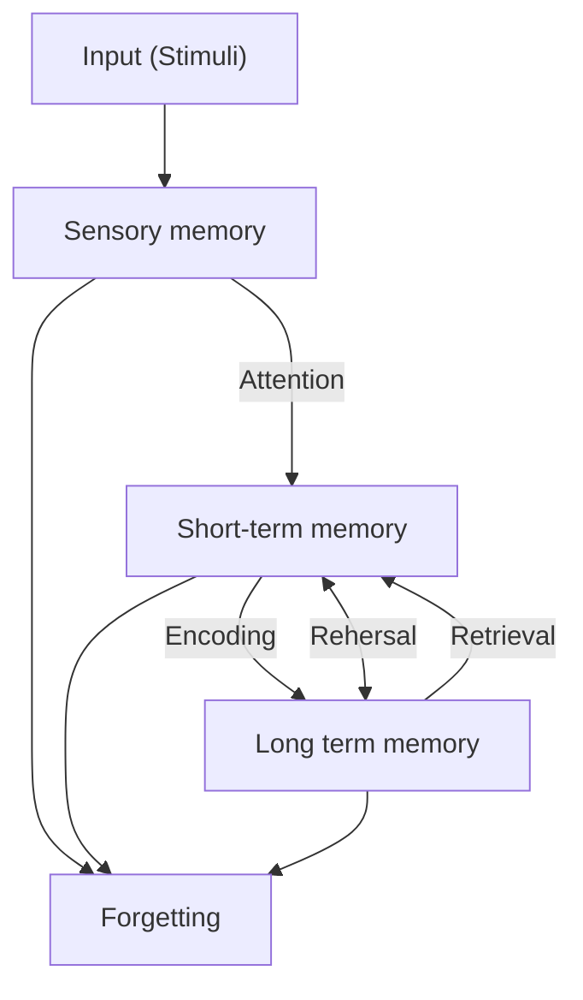

# A

## Andersona taksonomija

Arī dēvēta Blūma uzlabotā taksonomija.

Kognitīvajā jomā tiek mainīti vietām izvērtējums un sintēze, kā arī šie soļi kļūst no lietvārdiem par darbības vārdiem

![[Pasted image 20250219174432.png]]

![[Pasted image 20250219174600.png]]

Šajā taksonomija progress ir 2 dimensijās - zināšanu dimensijā un Izziņas procesu dimensijā.

Izziņās procesu dimensija redzama attēlā, zināšanu dimensijā ir Fakti, tad Konceptuālās, tad Proceduālās, tad Meta-kognitīvās zināšanas

![[Pasted image 20250219183025.png]]

No [[2025-02-19#Izglītības mērķu taksonomijas]]

## ARCS modelis

ARCS (Attention, Relevance, Confidence, Satisfaction) jeb:
- Uzmanība - uztveres, izziņas kairinātāji, stimuli, dažādība
- Atbilstība - Mērķis, Motīvu sakritība (vai tas ko māca ir tas ko vēlas), atpazīstamība
- Pārliecība - Prasību izpilde, Iespēja un izdošanās, Atbildība
- Apmierinātība - Iekšējie apbalvojumi, Ārējie apbalvojumi, ieguldījums (atgriezeniskā saite)

No [[2025-02-26#Motivācijas loma mācīšanās procesā]]

## Atkinson & Shiffrin memory model

## Atmiņa

Process, kas ietver informācijas iegaumēšanu, glabāšanu, atcerēšanos un aizmiršanu

No [[2025-02-19#Atmiņa]]
Skat [[#Atkinson & Shiffrin memory model]]

## Audiālais mācīšanās stils

Mācās caur dzirdi

Skat. [[#Mācīšanās stils]]

No [[2025-02-19#Atmiņa]]

# Ā

# B

## Biheiviorisms

Teorija, ka cilvēka uzvedību iespējams **ietekmēt** un **kontrolēt** ar ārējiem stimuliem.
No šī loģiski izriet balvu/sodu sistēma.

Raksturīga pārbaudāmība, sekas, nejaušība, neuzmācīgas un neierobežojošas metodes.
Bet neuzmācīgas un neierobežojošas metodes ir diezgan maldīgs, jo bieži tas arī nav sastopams.

No [[2025-02-26#Biheiviorisms]]

## Blūma atjaunotā taksonomija

![[MPM_Jēdzieni#Blūma uzlabotā taksonomija]]

## Blūma digitālā taksonomija

Katram no [[#Blūma uzlabotā taksonomija]] minētajiem slāņiem piesaista individuālas platformas.

## Blūma taksonomija

Veidojās taksonomija 3 jomās:
- Afektīvā -> 5 līmeņi
- Psihomotorā -> 6 līmeņi
- Kognitīvā -> 6 līmeņi

**Afektīvā** joma raksturo spēju izmantot emocijas kā mācīšanās procesa rezultātu

Pamatā Uztveršana, tad reaģēšana, novērtēšana, organizēšana un konceptualizēšana, Raksturošana ar vērtību palīdzību

**Psihomotorā** raksturo spēju pielietot motorās prasmes.

Pamatā refleksās kustības, tad Pamata kustības, uztveres spējas, fiziskās spējas, kvalificētas kustības, bezvārdu komunikācija

**Kognitīvajā** jomā ietilpst cilvēka spēja jēgpilni apstrādāt informāciju

Pamatā zināšanas, tad sapratne, pielietojums, analīze, sintēze, izvērtēšana.

![[Pasted image 20250219174731.png]]

## Blūma uzlabotā taksonomija

>[!warning] Nejaukt ar [[#Blūma taksonomija]] vai [[#Blūma digitālā taksonomija]]

![[#Andersona taksonomija]]

# C

## Cone of learning (Edgar Dale)

![[Pasted image 20250219171137.png]]

Pēc 2 ned. mēs atceramies 10% lasītā, 20% dzirdētā, 30% redzētā, 50% no dzirdētā un redzētā, 70% no tā ko sakām, 90% no tā ko sakām un darām

# Č

# D

## Darba atmiņa

![[#Īstermiņa atmiņa]]

## Deklaratīvā atmiņa

Raksturo atmiņu, kurā ir pieredze, atmiņas, fakti, zināšanas.

No [[2025-02-19#Atmiņa]]
# E

## Eksperimentālā mācīšanās

Teorija pa virsu [[#Konstruktīvisms|konstruktīvismam]], kas fokusējas uz pētīšanu un personālo interesi.

# Ē

# F

# G

## Ganjē taksonomija

Taksonomija dalās 2 dimensijās:

- 5 mācīšanās kategorijās
- 9 mācību notikumi

Mācīšanās kategorijas:
1. Intelektuālās prasmes
2. Kognitīvās stratēģijas
3. Mutiska informācija
4. Motoriskās prasmes
5. Attieksme

Mācību notikumi:
1. Uzmanības pievēršana
2. Sasniedzamais rezultāts
3. Iepriekšējas zināšanas
4. Jaunā materiāla prezentācija
5. Virzīt un atbalstīt mācīšanos - tehniski var notikt visā procesā
6. Lietot jauno informāciju
7. Atgriezeniskā saite
8. Novērtēšana - var kādā veidā novērtēt paši sevi vai piemēram skolotājs skolēnus
9. Pārneses sekmēšana - spēj pārnest info uz citu tēmu

No [[2025-02-19#Izglītības mērķu taksonomijas]]
## Globālais mācīšanās stils
Mācīšanās stils, kas fokusējas uz pilno bildi caur abstrakcijām.

Skat. [[#Mācīšanās stils]]

# Ģ

# H

# I

## Ilgtermiņa atmiņa

Info glabā ilgstoši 

No [[2025-02-19#Atmiņa]]

## Izvairīšanās motivācija

Izvairīšanās motivācijas mērķis ir uzvedības virzīšana prom no negatīviem stimuliem (objektiem, notikumiem, iespējām).

Dalās 2 daļās - pieejas motivācija, izvairīšanās motivācija.
Pieejas motivācija - tas ko mēs gribam, kas mūs motivē darīt
Izvairīšanās motivācija - tas ko mēs negribam, kas mūs motivē izvairīties

# Ī

## Īstermiņa atmiņa

Arī darba atmiņa, short-term memory.

No [[2025-02-19#Atmiņa]]

# J

# K

## Kinētiskais mācīšanās stils

Mācās caur fiziskām darbībām.

Skat. [[#Mācīšanās stils]]

## Kognitīvais konstruktīvisms

[[#Konstruktīvisms|Konstruktīvisma]] veids, kas koncentrējas uz cilvēka paša savu pasaules uztveri, balstoties uz individuālo pieredzi un zināšanām. 
## Kognitīvās attīstības teorija

Cilvēka kognīcijaskapacitāte slēpjas bioloģiskajos un psiholoģiskajos aspektos, ko iedalīja 4 periodos:
- Sensorimotorās inteliģences periods 0 - 2 gadi
- Sagatavošanās un darbības periods 2 - 12 gadi
- Pirmsoperāciju reprezentācijas apakšperiods 2 - 7 gadi
- Operāciju reprezentācijas apakšperiods 7 - 12 gadi
- Formāli operatīvais periods 12 - 18 gadi

No [[2025-02-26#Kognitīvisms]]
## Kognitīvisms

[[#Paradigma]], kas uztver domāšanas, atmiņas, problēmrisināšanas, zināšanu nozīmi.

Pamatā trivializē cilvēka prātu līdz tam, ka prāts apstrādā informāciju kā dators.

No [[2025-02-26#Kognitīvisms]]

## Kognīcija

Veids kā cilvēks izzina pasauli , interpretē un skaidro notikumus
Atbild uz jautājumiem *Ko?* un *Kas?*

Skat. arī [[MPM_Jēdzieni#Metakognīcija]]
No [[2025-02-19#Kognitīvie procesi]]

## Konstrukcionisms

Pamatidejā tas, ka mācīšanās procesam jānodrošina aktīva darbošanās, kas veido taustāmu rezultātu, ne tikai shēmu galvā.

## Konstruktīvisms

[[#Paradigma]], kas koncentrējas uz skolēnu kā svarīgu mācību procesa dalībnieku, kurš pats veido un rada zināšanas caur savu darbību

Dalās sīkāk Kognitīvajā, sociālā un apvienotā konstruktīvismā.

No [[2025-02-26#Konstruktīvisms]]

# Ķ

# L

# Ļ

# M

## Mācīšanās stils

vairākas kategorijas:
- [[#Vizuālais mācīšanās stils]]
- [[#Audiālais mācīšanās stils]]
- [[#Secīgais mācīšanās stils]]
- [[#Kinētiskais mācīšanās stils]]
- [[#Globālais mācīšanās stils]]

## Metakognīcija

Spēja domāt par savu domāšanu, smadzeņu darbību, kā notiek mācīšanās, kā adaptēties smadzeņu procesam. Nevis *Ko?* bet *Kā?*

Skat. [[#Kognīcija]]
No [[2025-02-19#Kognitīvie procesi]]

## Motivācija

Ietekmē uz mērķi vērstas uzvedības sākšanu, virzību, apmēru, neatlaidību, turpināšanu un kvalitāti.
# N

## Nosacījuma stimuls

Sākotnēji neatkarīgs stimuls, kas ticis sasaistīts ar beznosacījuma stimulu, lai to izsauktu manuāli.

Šis stimuls liek izsaukt nesaistītu reakciju citā būtnē.

# Ņ

# O

# P

## Paradigma

Metodes kā kaut ko darīt (piem. mācīt), kuru pamatā ir konkrētas teorijas/teorēmas.

No [[2025-02-26#Kas ir paradigma?]]

## Pašefektivitātes teorija

Attiecināma uz indivīda pārliecību, ka tas var veiksmīgi sasniegt konkrētu rezultātu.

Šo pārliecību var ietekmēt ārējie faktori.
Daži piemēri faktoriem:
- Iepriekšēja pieredze - gan pozitīvi, gan negatīvi
- Aizstājoša pieredze - Citu cilvēku pieredze
- Verbāla ietekmējoša - niecinājumi vai slavējumi
- Fizioloģiskais fons - satraukums un spēja koncentrēties.

Zema pašektivitāte:
- Cilvēki tendēti izvairīties no uzdevumiem, kas viņiem šķiet grūti, jo tie tiek asociēti ar draudiem
- Šādi cilvēki sev uzstāda mērķus, ko zina, ka varēs izpildīt, bet iesaiste veicamajā darbā nav augsta
Augsta pašefektivitāte:
- Cilvēki tendēti uztvert izaicinājumus, kā iespēju augt un attīstīties
- Šādi cilvēki nosaka sev augstus mērķus un ir neatlaidīgi to sasniegšanā
- Pārāk augsta pašefektivitāte var neļaut objektīvi izvērtēt situāciju

No [[2025-02-26#Motivācijas loma mācīšanās procesā]]

## Pašnoteikšanās teorija

Teorija skairdro cilvēka 3 psiholoģiskās vajadzības, kas ir būtiskas, lai veidotos motivācija.

3 psiholoģiskās vajadzības:
- Autonomija - spēja veikt izvēles
- Kompetence - sajūta, ka esi pieredzējis
- Saistības - Sajūta ka cilvēks ir piederīgs grupai

No [[2025-02-26#Motivācijas loma mācīšanās procesā]]

## Plūsmas teorija

Mācīšanās notiek kad prasmes un izaicinājums ir balansā.
Pārāk grūti -> trauksme
Pārāk labas prasmes -> garlaicība

No [[2025-02-26#Motivācijas loma mācīšanās procesā]]

## Pragmatisms

Teorija pa virsu [[#Konstruktīvisms|konstruktīvismam]]

Fokusējas uz:
- Starpdisciplinārā mācīšanās
- Skolotājs koordinē un virza darbību
- Mācīšanās caur darīšanu

No [[2025-02-26#Konstruktīvisms]]

## Procedurālā atmiņa

Pretēja [[#Deklaratīvā atmiņa]]
Raksturo motora atmiņu, kustības, zīmēšana runāšana u.c.

No [[2025-02-19#Atmiņa]]
# Q

# R

# S

## Secīgais mācīšanās stils

Mācīšanās stils, kurā mācās caur secīgiem soļiem

Skat [[#Mācīšanās stils]]
No [[2025-02-19#Uztveres īpatnības un mācīšanās stili]]

## Shēmas teorija

Visas zināšanas tiek glabātas kognitīvās struktūrās - shēmās.

Jaunas zināšanas *asimilē* vai *izmitina*
Asimilācija integrē informāciju esošās shēmās.
Izmitināšana nonāk konfliktā un pielāgo esošās zināšanas.

## Short-term memory

![[#Īstermiņa atmiņa]]

##  Sociāli kognitīvā teorija

Indivīda zināšanu apguve var būt tieši saistīta ar citu novērošanu sociālā mijiedarbībā

## Sociālais konstruktīvisms
[[#Konstruktīvisms|Konstruktīvisma]] veids, kur Sociālas interakcijas nozīme prasmju un zināšanu apguvē ir svarīga

No [[2025-02-26#Konstruktīvisms]]

## SOLO taksonomija

SOLO - Structure of Observed Learning Outcomes jeb Novēroto mācīšanās rezultātu struktūra

Mērķis: Izprast un novērtēt skolēnu kognitīvo attīstību mācību procesā.

Vairāki līmeņi, kur skolēni analizē zināšanu līmeni.
![[Pasted image 20250219180151.png]]

**Pirms strukturālā**: Nezin neko
**Vienas struktūras**: zin vienu konceptu un var definēt
**Vairāku struktūru**: zin konceptus, taču nesaista tos kopā
**Savstarpējo attiecību**: spēj savienot konceptus.
**Paplašināto abstraktu**: spēj savienot konceptus ar citām tēmām plašākā kontekstā.

Viss balstīts roku žestos.

No [[2025-02-19#Izglītības mērķu taksonomijas]]

## Spēliskošana

>[!danger] Nav Spēļošana

Mācīšana un motivēšana caur spēli.

Arī Spēlē balstīta mācīšana.

# Š

# T

## Taksonomija

Iedalījums, hierarhija, klasifikācija, sistematizācija

No [[2025-02-19#Izglītības mērķu taksonomijas]]

## Tuvākās attīstības zonas teorija
Angl. Zone of proximal development

Attīstība var notikt tikai kad prasmes un izaicinājums ir balansā.

No [[2025-02-26#Konstruktīvisms]]

# U

## Uzmanība

Kognitīva saite starp informācijas ierobežotu apjomu ar ko manipulē psihe, un reāli pieejamu visu informācijas daudzumu.

Uzmanība galvenokārt saistīta ar to, ka apstrādājamās informācijas ir vairāk nekā resursi ar ko to apstrādāt.

Uzmanības funkcijas
10. Modrība - Vai tiek aktīvi reģistrēti stimuli?
11. Konkrētu stimulu meklēšana - Uztver vienu vai vairākus stimulus meklējot konkrētu stimulu.
12. Selektīva uzmanība - Pievērš uzmanību viena veida stimulam.
13. Dalīta uzmanība - Ņem vērā vairākus stimulus

## Uztvere

Uztverei ir 2 daļas.

Sajūtas un Iepriekšējās zināšanas.
Sajūtas - sensorā informācija

Uztvere ir Sajūtu interpretēšana izmantojot iepriekšējās zināšanas

# Ū

# V

## Vizuālais mācīšanās stils
Mācās no vizuāliem materiāliem, galvenokārt caur redzi

Skat. [[#Mācīšanās stils]]

# W

# X

# Y

# Z

# Ž
