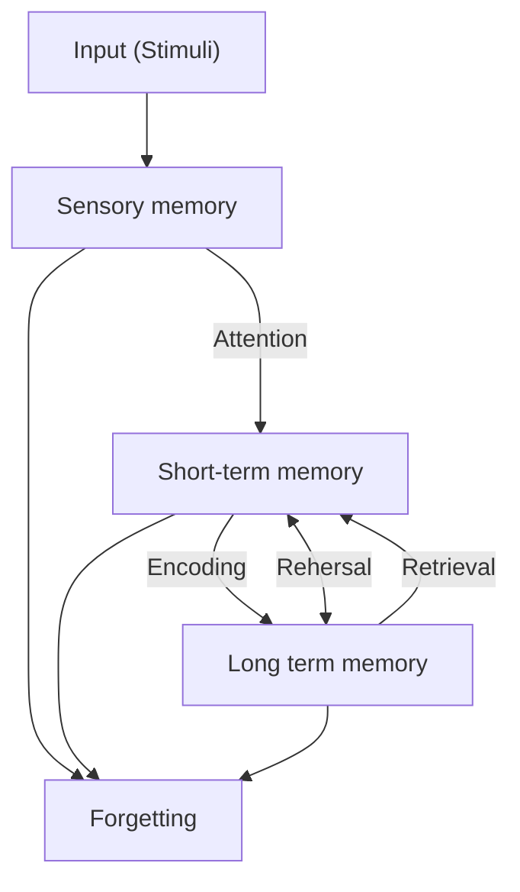

# A

## Andersona taksonomija

Arī dēvēta Blūma uzlabotā taksonomija.

Kognitīvajā jomā tiek mainīti vietām izvērtējums un sintēze, kā arī šie soļi kļūst no lietvārdiem par darbības vārdiem

![[Pasted image 20250219174432.png]]

![[Pasted image 20250219174600.png]]

Šajā taksonomija progress ir 2 dimensijās - zināšanu dimensijā un Izziņas procesu dimensijā.

Izziņās procesu dimensija redzama attēlā, zināšanu dimensijā ir Fakti, tad Konceptuālās, tad Proceduālās, tad Meta-kognitīvās zināšanas

![[Pasted image 20250219183025.png]]

No [[2025-02-19#Izglītības mērķu taksonomijas]]
## Atkinson & Shiffrin memory model

## Audiālais mācīšanās stils

Mācās caur dzirdi

Skat. [[#Mācīšanās stils]]

No [[2025-02-19#Atmiņa]]

## Atmiņa

Process, kas ietver informācijas iegaumēšanu, glabāšanu, atcerēšanos un aizmiršanu

No [[2025-02-19#Atmiņa]]
Skat [[#Atkinson & Shiffrin memory model]]

# Ā

# B

## Blūma atjaunotā taksonomija

![[MPM_Jēdzieni#Blūma uzlabotā taksonomija]]

## Blūma digitālā taksonomija

Katram no [[#Blūma uzlabotā taksonomija]] minētajiem slāņiem piesaista individuālas platformas.

## Blūma taksonomija

Veidojās taksonomija 3 jomās:
- Afektīvā -> 5 līmeņi
- Psihomotorā -> 6 līmeņi
- Kognitīvā -> 6 līmeņi

**Afektīvā** joma raksturo spēju izmantot emocijas kā mācīšanās procesa rezultātu

Pamatā Uztveršana, tad reaģēšana, novērtēšana, organizēšana un konceptualizēšana, Raksturošana ar vērtību palīdzību

**Psihomotorā** raksturo spēju pielietot motorās prasmes.

Pamatā refleksās kustības, tad Pamata kustības, uztveres spējas, fiziskās spējas, kvalificētas kustības, bezvārdu komunikācija

**Kognitīvajā** jomā ietilpst cilvēka spēja jēgpilni apstrādāt informāciju

Pamatā zināšanas, tad sapratne, pielietojums, analīze, sintēze, izvērtēšana.

![[Pasted image 20250219174731.png]]

## Blūma uzlabotā taksonomija

>[!warning] Nejaukt ar [[#Blūma taksonomija]] vai [[#Blūma digitālā taksonomija]] vai [[#Blūma uzlabotā taksonomija]]

![[#Andersona taksonomija]]

# C

## Cone of learning (Edgar Dale)

![[Pasted image 20250219171137.png]]

Pēc 2 ned. mēs atceramies 10% lasītā, 20% dzirdētā, 30% redzētā, 50% no dzirdētā un redzētā, 70% no tā ko sakām, 90% no tā ko sakām un darām

# Č

# D

## Darba atmiņa

![[#Īstermiņa atmiņa]]

## Deklaratīvā atmiņa

Raksturo atmiņu, kurā ir pieredze, atmiņas, fakti, zināšanas.

No [[2025-02-19#Atmiņa]]
# E

# Ē

# F

# G

## Ganjē taksonomija

Taksonomija dalās 2 dimensijās:

- 5 mācīšanās kategorijās
- 9 mācību notikumi

Mācīšanās kategorijas:
1. Intelektuālās prasmes
2. Kognitīvās stratēģijas
3. Mutiska informācija
4. Motoriskās prasmes
5. Attieksme

Mācību notikumi:
1. Uzmanības pievēršana
2. Sasniedzamais rezultāts
3. Iepriekšējas zināšanas
4. Jaunā materiāla prezentācija
5. Virzīt un atbalstīt mācīšanos - tehniski var notikt visā procesā
6. Lietot jauno informāciju
7. Atgriezeniskā saite
8. Novērtēšana - var kādā veidā novērtēt paši sevi vai piemēram skolotājs skolēnus
9. Pārneses sekmēšana - spēj pārnest info uz citu tēmu

No [[2025-02-19#Izglītības mērķu taksonomijas]]
## Globālais mācīšanās stils
Mācīšanās stils, kas fokusējas uz pilno bildi caur abstrakcijām.

Skat. [[#Mācīšanās stils]]

# Ģ

# H

# I

## Ilgtermiņa atmiņa

Info glabā ilgstoši 

No [[2025-02-19#Atmiņa]]

# Ī

## Īstermiņa atmiņa

Arī darba atmiņa, short-term memory.

No [[2025-02-19#Atmiņa]]

# J

# K

## Kinētiskais mācīšanās stils

Mācās caur fiziskām darbībām.

Skat. [[#Mācīšanās stils]]

## Kognīcija

Veids kā cilvēks izzina pasauli , interpretē un skaidro notikumus
Atbild uz jautājumiem *Ko?* un *Kas?*

Skat. arī [[MPM_Jēdzieni#Metakognīcija]]
No [[2025-02-19#Kognitīvie procesi]]

# Ķ

# L

# Ļ

# M

## Mācīšanās stils

vairākas kategorijas:
- [[#Vizuālais mācīšanās stils]]
- [[#Audiālais mācīšanās stils]]
- [[#Secīgais mācīšanās stils]]
- [[#Kinētiskais mācīšanās stils]]
- [[#Globālais mācīšanās stils]]

## Metakognīcija

Spēja domāt par savu domāšanu, smadzeņu darbību, kā notiek mācīšanās, kā adaptēties smadzeņu procesam. Nevis *Ko?* bet *Kā?*

Skat. [[#Kognīcija]]
No [[2025-02-19#Kognitīvie procesi]]
# N

# Ņ

# O

# P

## Procedurālā atmiņa

Pretēja [[#Deklaratīvā atmiņa]]
Raksturo motora atmiņu, kustības, zīmēšana runāšana u.c.

No [[2025-02-19#Atmiņa]]
# Q

# R

# S

## Secīgais mācīšanās stils

Mācīšanās stils, kurā mācās caur secīgiem soļiem

Skat [[#Mācīšanās stils]]
No [[2025-02-19#Uztveres īpatnības un mācīšanās stili]]

## Short-term memory

![[#Īstermiņa atmiņa]]

## SOLO taksonomija

SOLO - Structure of Observed Learning Outcomes jeb Novēroto mācīšanās rezultātu struktūra

Mērķis: Izprast un novērtēt skolēnu kognitīvo attīstību mācību procesā.

Vairāki līmeņi, kur skolēni analizē zināšanu līmeni.
![[Pasted image 20250219180151.png]]

**Pirms strukturālā**: Nezin neko
**Vienas struktūras**: zin vienu konceptu un var definēt
**Vairāku struktūru**: zin konceptus, taču nesaista tos kopā
**Savstarpējo attiecību**: spēj savienot konceptus.
**Paplašināto abstraktu**: spēj savienot konceptus ar citām tēmām plašākā kontekstā.

Viss balstīts roku žestos.

No [[2025-02-19#Izglītības mērķu taksonomijas]]

## Spēliskošana

>[!danger] Nav Spēļošana

Mācīšana un motivēšana caur spēli.

Arī Spēlē balstīta mācīšana.

# Š

# T

## Taksonomija

Iedalījums, hierarhija, klasifikācija, sistematizācija

No [[2025-02-19#Izglītības mērķu taksonomijas]]

# U

## Uzmanība

Kognitīva saite starp informācijas ierobežotu apjomu ar ko manipulē psihe, un reāli pieejamu visu informācijas daudzumu.

Uzmanība galvenokārt saistīta ar to, ka apstrādājamās informācijas ir vairāk nekā resursi ar ko to apstrādāt.

Uzmanības funkcijas
10. Modrība - Vai tiek aktīvi reģistrēti stimuli?
11. Konkrētu stimulu meklēšana - Uztver vienu vai vairākus stimulus meklējot konkrētu stimulu.
12. Selektīva uzmanība - Pievērš uzmanību viena veida stimulam.
13. Dalīta uzmanība - Ņem vērā vairākus stimulus

## Uztvere

Uztverei ir 2 daļas.

Sajūtas un Iepriekšējās zināšanas.
Sajūtas - sensorā informācija

Uztvere ir Sajūtu interpretēšana izmantojot iepriekšējās zināšanas

# Ū

# V

## Vizuālais mācīšanās stils
Mācās no vizuāliem materiāliem, galvenokārt caur redzi

Skat. [[#Mācīšanās stils]]

# W

# X

# Y

# Z

# Ž
